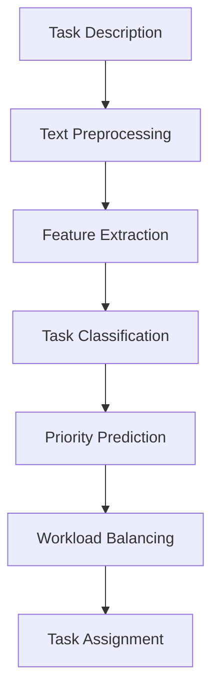

# 🚀 AI-Powered Task Management System

An intelligent task management platform that uses **Machine Learning** and **Natural Language Processing (NLP)** to automatically **classify**, **prioritize**, and **assign** tasks based on task descriptions, deadlines, and team workloads.

---

## 📌 Problem Statement

Managing large numbers of tasks manually can be time-consuming and inefficient. This project automates task management by leveraging ML models to predict task categories, estimate priority levels, and intelligently distribute tasks among team members.

---

## ✨ Features

* 🏷️ Automatic Task Classification
* ⚡ Priority Prediction (Low, Medium, High, Critical)
* 👥 Smart Task Assignment
* 📊 Workload Balancing
* 📈 Performance Analytics Dashboard
* 🤖 NLP-based Text Processing

---

## 🏗️ System Workflow



---

## 🛠️ Tech Stack

| Category        | Technologies                             |
| --------------- | ---------------------------------------- |
| Language        | Python                                   |
| NLP             | NLTK, TF-IDF                             |
| ML Models       | Naive Bayes, SVM, Random Forest, XGBoost |
| Data Processing | Pandas, NumPy                            |
| Visualization   | Matplotlib, Seaborn                      |
| Deployment      | Streamlit / Flask                        |
| Version Control | Git, GitHub                              |

---

## 📂 Project Structure

```bash
AI-Powered-Task-Management-System/
│
├── data/
├── notebooks/
├── src/
│   ├── preprocessing.py
│   ├── classifier.py
│   ├── priority_model.py
│   └── workload_balancer.py
│
├── models/
├── dashboard/
├── requirements.txt
└── README.md
```

---

## 🤖 Machine Learning Models

### Task Classification

* Naive Bayes
* Support Vector Machine (SVM)

### Priority Prediction

* Random Forest
* XGBoost

---

## 📊 Evaluation Metrics

* Accuracy
* Precision
* Recall
* F1 Score
* ROC-AUC

---

## 🚀 Installation

```bash
git clone https://github.com/your-username/AI-Powered-Task-Management-System.git

cd AI-Powered-Task-Management-System

pip install -r requirements.txt
```

---

## ▶️ Run the Project

### Train Models

```bash
python src/classifier.py
python src/priority_model.py
```

### Launch Dashboard

```bash
streamlit run dashboard/app.py
```

---

## 📈 Expected Outcomes

✔ Automated Task Categorization

✔ Accurate Priority Prediction

✔ Balanced Workload Distribution

✔ Improved Team Productivity

✔ Data-Driven Decision Making

---

## 🔮 Future Enhancements

* BERT-based Classification
* Real-time Task Assignment
* Jira/Trello Integration
* Cloud Deployment
* Team Performance Analytics

---

## 👨‍💻 Author

**Shaheen Shaik and Srisharan**

Machine Learning & Data Science Project

---

⭐ If you found this project useful, consider giving it a star.
